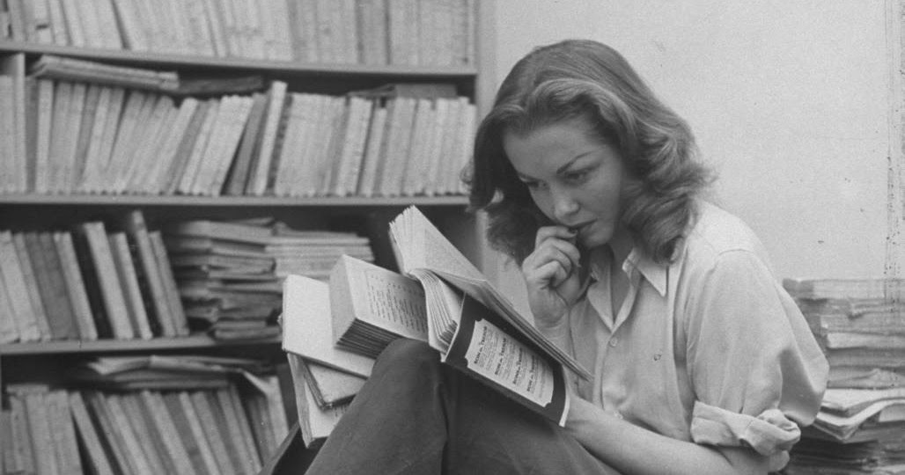

+++
title = "Books"
description = "About page linstit.pw: Nothing important, I write here to stay sane."
date = "2022-10-28"
author = "Erwin"
url = "books"
type = "books"
+++

> <h4>Books I loved or hated or just wanted to share my thoughts on, with no special order</h4>
> <i>Cogito, ergo sum — René Descartes</i>

 

Rating Description:

        *****: I loved it
        ****: It was good enough
        ***: It was good or just not-bad
        **: Meh
        *: Stay away from this one

 

Not all the books I have read so far, just those I wanted to share on my blog since I was not *too* lazy to share here. Goodreads is a better place to show off what you've read.

 

<a href="https://www.goodreads.com/book/show/30796677">نامه‌ای در باب تساهل</a> by <a href="https://www.goodreads.com/author/show/51746.John_Locke">John Locke</a> 
My rating: <a href="https://www.goodreads.com/review/show/5099808834">5 of 5 stars</a>  
فوق‌العاده است. کاش 10 سال پیش این کتاب رو خونده بودم. به همه پیشنهاد می‌کنم خصوصاً مذهبی‌ها. ترجمه هم بسیار روان هست. --- درباره خود کتاب چیزی نمی‌گم چون نام آقای لاک و عنوان کتاب به‌اندازه کافی برای اون‌هایی که در فکر دستیابی به حکمت هست جذاب بنظر می رسه. --- نظرم عوض شد، لازمه که بگم کتاب درواقع منشا ایده‌ای هست که بهش جدایی دین و سیاست می‌گن، یعنی لاک در این کتاب بیان می‌کنه چرا باید دولت از کلیسا جدا باشه تا مومنان به رستگاری برسن. لاک از تساهل مذهبی می‌گه، یعنی انواع دیگه تساهل، مثل تساهل سیاسی رو نمی‌گه. لاک (شاید برای تقیه) ادعای سنگینی علیه کلیسا مطرح نمی‌کنه و دین برتر رو مسیحیت معرفی می‌کنه و بجز یک مورد از ادیان دیگه (حتا ادیان ابراهیمی) حرفی به میان نمیاره. --- شاید بعدا باز هم آپدیتش کردم.
  
<a href="https://www.goodreads.com/review/list/97499153">View all my reviews</a>

<a href="https://www.goodreads.com/book/show/12704670">تاریخ ایران مدرن</a> by <a href="https://www.goodreads.com/author/show/22208.Ervand_Abrahamian">Ervand Abrahamian</a> 
My rating: <a href="https://www.goodreads.com/review/show/5047584752">4 of 5 stars</a>  

  
<a href="https://www.goodreads.com/review/list/97499153">View all my reviews</a>

<a href="https://www.goodreads.com/book/show/57392757">هم شرقی هم غربی: تاریخ روشنفکری مدرنیته ایرانی</a> by <a href="https://www.goodreads.com/author/show/283921.Afshin_Matin_Asgari">Afshin Matin-Asgari</a> 
My rating: <a href="https://www.goodreads.com/review/show/4722370179">4 of 5 stars</a>  
پر از جزئیات تاریخی و ارجاعات علمی برای من زیاد طول کشید تا تموم بشه شاید برای بقیه طول نکشه، اما خب دلیل من برای طول دادن کتاب ارجاعات بسیارشه، کتابی نیست که بشه از ارجاعات بسیارش گذشت، باید ارجاعات موضوعاتی که برام جذاب می‌اومدن رو مطالعه می‌کردم و این حداقل به حجم کتاب 100 درصد اضافه کرد، هرچند ناشی بودن من هم درش بی‌تاثیر نبود کتابی بود که خیلی ازش لذت بردم، اگر دوستان هم به سیر روشنفکری ایران و اون نقاط کوری که کمتر بهشون پرداخته شده علاقمند هستن بهشون پیشنهاد می‌کنم مقدمه کتاب که شرحی بر فصل‌ها هست رو یک نگاه بندازن، پشیمون نمی‌شن
  
<a href="https://www.goodreads.com/review/list/97499153">View all my reviews</a>

<a href="https://www.goodreads.com/book/show/12971332">ورشو ۱۹۲۰: تلاش نافرجام لنین برای چیرگی بر اروپا</a> by <a href="https://www.goodreads.com/author/show/80276.Adam_Zamoyski">Adam Zamoyski</a> 
My rating: <a href="https://www.goodreads.com/review/show/4959959642">4 of 5 stars</a>  
فصل‌های اول و دوم و آخر پر از مفاهیم تاریخی مناسب عموم هستن اما فصل‌های میانی ممکنه برای کسانی که زیاد به جزئیات لشکرکشی‌های قوا علاقمند نباشن، خسته‌کننده باشه. نتیجه‌گیری جالب اما نادقیقی فصل آخر، من شخصاً خیلی لذت بردم. ترجمه هم عالی هست.
  
<a href="https://www.goodreads.com/review/list/97499153">View all my reviews</a>

<a href="https://www.goodreads.com/book/show/17286670-scarcity">Scarcity: Why Having Too Little Means So Much</a> by <a href="https://www.goodreads.com/author/show/4346246.Sendhil_Mullainathan">Sendhil Mullainathan</a> 
My rating: <a href="https://www.goodreads.com/review/show/5029423633">4 of 5 stars</a>  
One of the bests I've read. Though the book provides no actual solution for the problem I just couldn't avoid reading it.
  
<a href="https://www.goodreads.com/review/list/97499153">View all my reviews</a>

<a href="https://www.goodreads.com/book/show/24588979">فرهنگ سیاسی ایران</a> by <a href="https://www.goodreads.com/author/show/7084706._">محمود سریع‌القلم</a> 
My rating: <a href="https://www.goodreads.com/review/show/4514443774">4 of 5 stars</a>  
جناب سریع‌القلم و کارهاشون بسیار تأثيرگذار هستند بطورکلی ولی توی ربع این صفحات می‌شد همین مفهوم رو رسوند. ضمنا کتاب حول محور یک موضوع می‌چرخه صرفا درحالیکه مفاهیم اجتماعی-تاریخی عوامل بسیاری درشون دخیل هست. کتاب تلاشی برای نقد و بیان دیگر دیدگاه‌های عقب‌ماندگی در ایران نمی‌کنه و صرفا به ایده نویسنده پرداخته می‌شه. اطلاعات کتاب درباره باقی کشورهای تولیدکننده نفت کمی قدیمی هستند که شاید دلیلش زمان نوشته شدن کتاب بوده باشه؛ علی‌ای‌حال کتابی هست که بعدش نمی‌گید وقتم رو هدر دادم و کاش جاش رفته بودم غازچرانی. دیدگاه نسبتا خوبی در باب کل‌نگری و نقش پدرسالاری در جوامع بطورکلی و نه صرفا ایران به شما می‌ده. ایده جناب مونتسکیو که دیکتاتوری در خانه آموخته شده و در جامعه در سطوح کلان اجرا می‌شه (روح‌القوانین) رو آقای سریع‌القلم به خوبی در ایران شرح دادند که بسیار کار جذابی بود. بعد از خوندن این کتاب احتمالا راغب خواهید شد باقی آثار جناب سریع‌القلم رو هم دنبال کنید هرچند اگر مثل من سریع‌القلم-فن بوده باشید بسیاری جملات، مفاهیم و کلیدواژه‌ها براتون تکراری خواهد بود.
  
<a href="https://www.goodreads.com/review/list/97499153">View all my reviews</a>

<a href="https://www.goodreads.com/book/show/13081787">انقلاب مجارستان: مقاومت مردمی علیه توتالیتاریسم</a> by <a href="https://www.goodreads.com/author/show/12806.Hannah_Arendt">Hannah Arendt</a> 
My rating: <a href="https://www.goodreads.com/review/show/5072367117">4 of 5 stars</a>  
بالاخره فضای کشور ملتهبه و آدم بهتره که مسلح به اندیشه باشه تا شعار و آرمان ------ آپدیت پس از پایان کتاب: کتاب زیبایی هست، بسیار زیبا و کامل، هرچند مسئله انقلاب مجارستان رو اجمالی بررسی می‌کنه و از دیدگاه یک انتلکت و نه یک شهروند و نه حتا یک شهروند مخالف؛ چیزی که من ترجیح می‌دم درموردش بدونم تحلیلی بسیار جالبی از شخصیت خروشچف ارائه داد که ناشی از شک اطراف چهره نسبتا مثبت خروشچف در ذهن من بود، واقعا لذت بردم کتاب پا رو از لحاظ تئوریک فراتر از انقلاب مجارستان می‌ذاره، توتالیتاریسم روسی رو بطور اجمالی بررسی می‌کنه و نقد خودش رو بر امپریالیسم روسی نشون می‌ده این کتاب تاریخ رو روایت نمی‌کنه هرچند شما می‌تونین به سادگی اسامی آشنایی مثل توخاچفسکی یا ژوکوف رو توش ببینید و با استالین و مسئله جانشینی در اتحاد شوروری آشنا بشید ترجمه قابل‌قبولی بود، دوستان لطف کنن کامنت نذارن ترجمه بد بود و قص علی هذا، چون نشون می‌ده با متون هانا آرنت آشنایی ندارن، که این هم نتیجه بی‌پلاسه بطورکلی، لذت بردم هرچند لفظ کتاب مناسبش نیست، بیشتر مقاله بود تا کتاب اما من کی باشم به خانوم آرنت نقدی وارد کنم؟ توی این روزها حتما بخونید
  
<a href="https://www.goodreads.com/review/list/97499153">View all my reviews</a>

*I did not even `like` this book, just put it here so you would avoid it.*  <a href="https://www.goodreads.com/book/show/36490332-talking-to-my-daughter-about-the-economy">Talking to My Daughter About the Economy: or, How Capitalism Works—and How It Fails</a> by <a href="https://www.goodreads.com/author/show/405898.Yanis_Varoufakis">Yanis Varoufakis</a> 
My rating: <a href="https://www.goodreads.com/review/show/4504541720">1 of 5 stars</a>  
Oh wow, it's just really for little girls. I feel like it was a complete waste of time. I hope this kind of bullshit will vanish. Reading it as an intellectual you may realize why Marxism is poison to the world. In fact, you may read it in 2 afternoons since it's too let's say 'For Kids Only' in my opinion. the writer has made sure that the book sells good amongst losers and makes a good fortune. So, leftist economists doing right-wing stuff? Weird world we're living in. Though, not a surprise, Thomas Piketty, also a leftist economist (who I admire) did so. Anyways, after finishing it this afternoon, just imagined how good it was if I could join the Golden Dawn Party of Greece. (: Cheers. Stay away from leftist populists.
  
<a href="https://www.goodreads.com/review/list/97499153">View all my reviews</a>

<a href="https://www.goodreads.com/book/show/1286237._">وداع با اسلحه</a> by <a href="https://www.goodreads.com/author/show/1455.Ernest_Hemingway">Ernest Hemingway</a> 
My rating: <a href="https://www.goodreads.com/review/show/4665652048">5 of 5 stars</a>  
Its sorrow never ends. In fact it may just effect me this much cuze I'm a war-freak nerd.
  
<a href="https://www.goodreads.com/review/list/97499153">View all my reviews</a>

<a href="https://www.goodreads.com/book/show/110115.Iranian_F_4_Phantom_II_Units_In_Combat">Iranian F-4 Phantom II Units In Combat</a> by <a href="https://www.goodreads.com/author/show/63747.Farzad_Bishop">Farzad Bishop</a> 
My rating: <a href="https://www.goodreads.com/review/show/4417923806">4 of 5 stars</a>  
Good book full of technical data but still not too complicated, but I shall say that it may get boring for non-aviators. Covering both war and the sky. Good Job.
  
<a href="https://www.goodreads.com/review/list/97499153">View all my reviews</a>

<a href="https://www.goodreads.com/book/show/2387440._">مرشد و مارگریتا</a> by <a href="https://www.goodreads.com/author/show/3873.Mikhail_Bulgakov">Mikhail Bulgakov</a> 
My rating: <a href="https://www.goodreads.com/review/show/4417039737">5 of 5 stars</a>  
A book you never forget. I may read it once again, since it rebuilt my imagination.
  
<a href="https://www.goodreads.com/review/list/97499153">View all my reviews</a>

<a href="https://www.goodreads.com/book/show/27421918">دروغگویی روی مبل</a> by <a href="https://www.goodreads.com/author/show/909675.Irvin_D_Yalom">Irvin D. Yalom</a> 
My rating: <a href="https://www.goodreads.com/review/show/5076853066">3 of 5 stars</a>  
A book that started like a storm but continued like the author had to write more and more and more. Though it got really better at the end, it never got as well as the beginning and when finished, I wasn't sad enough. Maybe I needed it to finish so I could get rid of it and read something more valuable. Added some really good ideas to my knowledge of Psychology and persuaded me to go see another therapist again, the problem is that I really don't think there is good therapists in Iran or Shiraz (where I live in the south of Iran). I enjoyed it, but not so much.
  
<a href="https://www.goodreads.com/review/list/97499153">View all my reviews</a>

<a href="https://www.goodreads.com/book/show/33917107-on-tyranny">On Tyranny: Twenty Lessons from the Twentieth Century</a> by <a href="https://www.goodreads.com/author/show/243930.Timothy_Snyder">Timothy Snyder</a> 
My rating: <a href="https://www.goodreads.com/review/show/5090849990">3 of 5 stars</a>  
کتاب متوسطی بود، حدس می‌زدم از چنین شخص مهمی اثر بهتری ببینم که کمی ناامید شدم. ارجاعات تاریخی یک سر و گردن از خود کتاب بالاتر بودن و حس می‌کنم کتاب برای فروخته شدن نوشته شده و نه تأثیرگذاری. علی‌ای‌حال کتابی بود که توی دوتا بعدازظهر مطالعه کردم و لذت بردم. شاید لذت‌بخش نباشه مطالعه آثار افرادی که باهاشون موافق نیستیم، ولی برای لذت‌بخشه. بطورکلی فصل آخر (یا پی‌گفتار) بسیار بهتر از باقی قسمت‌های کتابه. دست‌کم اون لایق وقتم بود. توی این روزهای پراسترس، بنظرم همونطور که قبلا هم گفتم، مسلح به اندیشه بودن بسیار بهتر از بنده آرمان و آرزو بودنه. با دوستمون که گفتن این کتاب کمی کلیشه‌ایه موافقم، تقریبا بجز فصل آخر همه برای عوام نوشته شده بود. بازهم موافقم که لیاقت یک بار خونده شدن در دو یا سه بعدازظهر رو داره.
  
<a href="https://www.goodreads.com/review/list/97499153">View all my reviews</a>

<a href="https://www.goodreads.com/book/show/60805557">В меняющемся мире</a> by <a href="https://www.goodreads.com/author/show/14796407._">Михаил Горбачев</a> 
My rating: <a href="https://www.goodreads.com/review/show/5110235275">3 of 5 stars</a>  
I never disliked or loathed this man. I've always admired his bravery and never said anything negative about him, but this book may change my opinion of him. A Persian version with the title "دنیایی رو به دگرگونی" is accessible on Taagche; it is translated directly from Russian and I've loved it so far. -- After finishing the book, I had the impression that I had been listening to the whining and pleas of an elderly woman who had confused vodka for tea. The book isn't as unique as I had anticipated. He seems to be grumbling about something all the time, and I never expected a man this democratic to be so communist! He appears to be making an effort to hide his guilt and present a partial truth. It wasn't good or horrible, just average. The passages about Boris Yeltsin were the book's only redeeming features. It is filled with names that, as I've already mentioned, call for some familiarity with the USSR, Europe, or even the US. Anyway, it wasn't all bad; it also helped to enlighten me a little.
  
<a href="https://www.goodreads.com/review/list/97499153">View all my reviews</a>

<a href="https://www.goodreads.com/book/show/331227.A_Short_History_of_Progress">A Short History of Progress</a> by <a href="https://www.goodreads.com/author/show/59669.Ronald_Wright">Ronald Wright</a> 
My rating: <a href="https://www.goodreads.com/review/show/5133336301">2 of 5 stars</a>  
نمی‌شه گفت کتاب بدی بود. درواقع بجز فصل آخر باقی کتاب نقظه نظر جالب نویسنده رو بیان می‌کنه و باعث می‌شه شخص از جذابیت‌های ذهن ادبی اون استفاده کافی رو ببره. اما فصل آخر که یجور جمع‌بندی یا نتیجه‌گیری هست نشون می‌ده کل کتاب واسه این نوشته شده که ذهن رو برای این نکته آخر آماده کنه؛ موضوعاتی که من زیاد باهاشون موافق نیستم. این استدلال همیشگی چپی‌هاست که بیان و بگن مثلا در سال ۲۰۰۸ این تعداد گرسنه در جهان وجود داشته. موضوع اینه که تصور غلطی وجود داره از جامعه سرمایه‌داری و انقلاب صنعتی. تصویری که از انقلاب صنعتی داریم یه سری بچه و نوجوون و زن هست که دارن به‌سختی توی کارخونه‌ها و معادن دو شیفت کار می‌کنن تا زنده بمونن. مسئله‌ای که ذهن کودکانه چپی بیان می‌کنه اینو در نظر نمی‌گیره که خیل سال‌های ۱۷۶۰ تا ۱۸۴۰ جمعیت بریتانیا چندین برابر شد، یعنی همین بچه‌هایی که در کارخونه‌ها کار می‌کردن به سن زاد و ولد رسیدن درحالیکه قبل از انقلاب صنعتی به سن زاد و ولد نرسیده از گرسنگی می‌مردن! ذهن کودکانه چپی اینو می‌گه که جمعیت بخاطر پیشرفت‌های تکنولوژیک باعث شده جمعیت در قرن بیستم چند برابر بشه ولی نمی‌گه اگر این رشد تکنولوژیک وجود نداشت، نرخ مرگ و میر ناشی از بیماری، گرسنگی و بی‌آبی ۱۰ برابر مقدار کنونی بود و رشد رفاه در اثر انقلاب صنعتیه و کاپیتالیسم! ذهن چپی به بیان این مسئله اکتفا می‌کنه که در شاخ آفریقا و هند مردم به آب لوله‌کشی دسترسی ندارن ولی نمی‌گه بریتانیای قبل از ۱۷۵۰ از هند امروزی به‌مراتب بدتر بود و هند سال ۱۷۵۰ ، بهتره من دهنمو ببندم تا متهم به تمایلات راسیستی نشدم. این ادعاها بارها شدن، از دهه‌های جنگ جهانی بگیر تا همین اواخر که با رسیدن ناخالص داخلی ژاپن به امریکا، قرن امریکا رو تمام‌شده می‌دونستن. اما من همیشه به علم و تکنولوژی تکیه می‌کنم، به فریتز هابر ومیلتون فریدمن. آخر کتاب یاد کتاب برخمان افتادم. پیشنهاد می‌کنم با ذهن باز به موضوع نگاه کنید. و موضوع آخر اینکه این جامعه چپی با اینکه نگرتن زیست‌بوم و گونه‌های جانوری هست چرا انقد نگران اینه که نسل انسان منقرض شه؟ مگه انسان بزرگترین خطر واسه گونه‌های جانوری و زیست‌بوم نیست؟ همه نباشیم همه‌چی بهتر نمی‌شه؟
  
<a href="https://www.goodreads.com/review/list/97499153">View all my reviews</a>

<a href="https://www.goodreads.com/book/show/61688280">بن لادن کیست؟</a> by <a href="https://www.goodreads.com/author/show/829919.Michael_Pohly">Michael Pohly</a> 
My rating: <a href="https://www.goodreads.com/review/show/5151345346">3 of 5 stars</a>  
در واقع از کتاب لذت بردم. کتاب سعی می‌کنه ریشه‌های بنیادگرایی اسلامی و حتا شباهت‌هاش با انواع دیگه تروریسم رو بررسی کنه. ازون دسته کتابا بود که حس می‌کنی یه خبرنگار اونا رو نوشته و برام جذاب بود. کتاب به القاعده و شخص بن‌لادن محدود نمی‌شه و حتا گوشه‌ای از تاریخ افغانستان بخصوص تاریخ طالبان رو می‌گه. کتابی هست که اجمالی نوشته شده ینی انتظار جزئیات دقیق ازش نداشته باشین، ضمنا احساس می‌کنم بخشیش مربوط به ایران بوده که حذف شده و من حال ندارم این مسئله رو راستی‌آزمایی کنم ولی می‌تونه اتفاق جالب ولی قابل‌حدثی باشه. کتابی نیست که ازش لذت نبرین. پیشنهادش می‌کنم چون علاوه‌بر چیزاییکه درباره بن‌لادن گفته می‌شن، چیزای ناگفته‌ای هم توش هست (مثل ویژگی‌های شخصیتیش و چرایی اینکه انقد بالا رفت)  احساس می‌کنم نویسنده خیلی تلاش کرده اسلام رو مثبت نشون بده، احتمالا دلیلش وابستگی‌های نویسنده است به احزاب مختلف یا حالا هر دلیل دیگه‌ای می‌ةونه داشته باشه و من نباید همه مشکلا رو با یه دید بررسی کنم شب بخیر
  
<a href="https://www.goodreads.com/review/list/97499153">View all my reviews</a>

<a href="https://www.goodreads.com/book/show/455696.Adolphe">Adolphe</a> by <a href="https://www.goodreads.com/author/show/113387.Benjamin_Constant">Benjamin Constant</a> 
My rating: <a href="https://www.goodreads.com/review/show/4761414818">4 of 5 stars</a>  
یک کامنت که منو قانع کرد کتاب رو بخونم: <i> تو نمایش‌نامه‌ی اسم، نوشته‌ی ماتیو دولاپورت، جایی ونسان میگه ادبیات فرانسه دو تا شخصیت قدر داره که یکیش آدلف، راوی و قهرمان کتاب بنژامن کنستانه. پیش از اینکه کتاب رو بخونم فکرش رو هم نمی‌کردم با یه رمانتیک تلخ و ساده رو به رو باشم. داستان مربوط میشه به رابطه‌ی بسیار عجیب و بسیار ملموس پسری از خانواده‌ای بزرگ با زنی که از خودش بزرگ‌تره و دست سرنوشت کارش رو به جایی رسونده که در جامعه‌ی قرن نوزدهمی اون دوران عزت و احترامی نداشته باشه. رابطه‌ای که جایی ادلف درباره‌ی طرفین درگیرش میگه " دو موجود سیه روزی که در دنیا ففط یکدیگر را داشتند و می‌توانستند عدالت را رعایت کنند، یکدیگر را درک کنند و تسلا دهند، چون دو دشمن خونی سرسختانه می‌خواستند همدیگر را تکه تکه کنند". رمانتیک مورد علاقه‌ام نیست و برام جذابیتی نداره. اما این کتاب رو دوست داشتم. عشق این کتاب هر چیزی داشت جز لطافت بی‌فایده و بار سانتی‌مانتالیسم اشک درآر. خبری از ابراز علاقه‌های چند صفحه‌ای، جملات پر طمطراق، در نگاه محو شدن‌ها و تپش قلب‌ها و گریه‌های شبانه نبود. و غریب اینکه آدلف رو بیشتر فهمیدم تا النور. آدلف رو بیشتر دوست داشتم تا النور. به آدلف بیشتر نزدیک بودم تا النور. آدلفی که ستم‌گره، ستم‌دیده است، یوغی به دست و پاش بسته است و خودش یوغیه به دست و پای دیگری. هم زندانیه و هم زندانبان. "دوست داشتن زمانی که دیگر دوستتان ندارند بدبختی بزرگی است. اما از آن بدتر این است که زمانی که شما دیگر احساس عشق نمی‌کنید با عشقی شورانگیز دوستتان داشته باشند " جان کلام کتاب برای من چکیده‌ی این جمله بود: بدا به حال مردی که در کنار معشوقه‌اش بداند و پیش‌بینی کند که هیچ بعید نیست روزی از او دل بکند" فکر کنم باید گفت بدا به حال انسانی که در کنار معشوقه‌اش بداند و پیش‌بینی کند که هیچ بعید نیست روزی از او دل بکند. عشق ترسناکه. ‌شاید بهتر باشه هیچ وقت پیش نیاد. به شدت می‌تونه آسیب‌زا باشه ولی انگار همه آغوش بازی دارن نسبت به این مهمان نامهربان. </i>  <a href="https://taaghche.com/book/5153/%D8%A2%D8%AF%D9%8F%D9%84%D9%81" target="_blank" rel="nofollow noopener"> a soul - https://taaghche.com/book/5153 </a>
  
<a href="https://www.goodreads.com/review/list/97499153">View all my reviews</a>

<a href="https://www.goodreads.com/book/show/60624746">چگونه پیر شویم: حکمت باستان برای نیمه‌ی دوم زندگی</a> by <a href="https://www.goodreads.com/author/show/13755.Marcus_Tullius_Cicero">Marcus Tullius Cicero</a> 
My rating: <a href="https://www.goodreads.com/review/show/5168650993">4 of 5 stars</a>  
بسیار کتاب جالبی بود و ترجمه روانی داشت. فارغ از خود کتاب، مقدمه گیرایی داشت که باعث شد با اینکه در ابتدا شک داشتم به مطالعه کردنش، شکم برطرف شد. خود کتاب گفتگویی است اطراف این موضوع که پیر شدن چی هست و آیا پیر شدن به رنجش می‌ارزه یا خیر. شاید برای سالخورده‌های ادیب کاربرد بیشتری داشته باشه تا منی که دهه ۳۰ رو هنوز تمام نکردم اما ارجاعات فراوانش به تاریخ، ادبیات و سیاست بسیار من رو مشعوف کرد. کتابی بود که از خوندنش بسیار لذت بردم! دیگه حس نمی‌کنم از پیری می‌ترسم، بالاخره یه دوره از زندگیه که رسیدن بهش معانی زیادی می‌تونه داشته باشه که یکیش هست پوست‌کلفتی! --- طاقچه: این کتاب راه‌های روبه‌رویی با بحران کهنسالی را شرح داده و به مقولهٔ پیری از نگاه حکمت باستان پرداخته است. نویسنده کتاب را در دهه ششم زندگی‌اش می‌نویسد. زمانی که همسرش را طلاق داده است و زن جوانی گرفته است و او را هم طلاق داده است و دخترش فوت کرده است. او در رساله کوچکی با عنوان در باب پیری به سالخوردگی پرداخته است. نویسندگان یونانی پیش از نویسنده به شکل‌های مختلف درباره پیری نویشنده‌اند، بعضی سالخوردگان را حکیم و بعضی دیگر آن‌ها مردمانی غرغرو نوشته‌اند.  اما سیسرو تصمیم دیگری دارد او می‌خواهد هم محدودیت‌های سالخوردگی را نشان دهد هم نشان دهد که سالخوردگی می‌تواند مسیر رشد باشد. او در این کتاب گفت‌و‌گوی خیالی‌ای بین کاتو و دو مرد جوان ترتیب می‌دهد و نظراتش را از زبان این فرمانده بیان می‌کند که قرن قبل سردار رومیان در جنگ بوده است.
  
<a href="https://www.goodreads.com/review/list/97499153">View all my reviews</a>

<a href="https://www.goodreads.com/book/show/60879700">ترجمه الغارات</a> by <a href="https://www.goodreads.com/author/show/22376420._">ابراهیم ثقفی</a> 
My rating: <a href="https://www.goodreads.com/review/show/5149441197">3 of 5 stars</a>  
کتاب جالبی بود اما انتظاراتم رو برآورده نکرد اصلا. سعی نکرده بود ذکاوت‌های سیاسی امام علی رو نشون بده،‌ ترجیح می‌دادم بجای اینکه به تطهیرش بپردازه واقعبت‌ها رو بگه چون واقعیت برای من جالبتره. مسئله بعد اینکه این کتاب توی بیان تاریخ ضعف‌هایی داره و من دو سه تا اختلاف توش دیدم: یعنی گفته بود فلانی با ۳۰۰۰ نفر حرکت کرد و بعد ۴۰۰ نفر برگشتن، جای دیگه گفته بود همون فلانی با ۶۰۰ نفر به یمن حمله کرد. به دید کسی که می‌خواد حیات سیاسی شخصیت‌ها رو بررسی کنه کتاب جالبی بود برای من. علی‌ای‌حال، کتاب با مسئله خوارج و نهروان شروع می‌شه و تا شهادت امام علی ادامه داره و چند نوشته بعد از شهادت اامام علی داره که بنظر من جالب نبودن چون خیلی مسئله رو احساسی می‌کنن؛ کتابی بود که ازش نمی‌شه گفت لذت نبردم. شاید مذهبی‌ها با دید دیگه‌ای به این کتاب نگاه کنن ولی خب من دیدم متفاوته. بطورکلی پیشنهادش نمی‌کنم چون انتظارات خودم رو هم براورده نکرد و باید سمت منابع دیگه‌ای دست دراز کنم.
  
<a href="https://www.goodreads.com/review/list/97499153">View all my reviews</a>

**Check my Goodreads page [here](https://www.goodreads.com/generwinromel).**

<a href="https://www.goodreads.com/book/show/56239284">فضیلت کناره گرفتن</a> by <a href="https://www.goodreads.com/author/show/1233651.Svend_Brinkmann">Svend Brinkmann</a> 
My rating: <a href="https://www.goodreads.com/review/show/5270756302">3 of 5 stars</a>  
حرف کلی کتاب اینه که انتخاب‌های متوسط و ضعیف زیاد داشتن خیلی بدتر از مجموعه محدودی از انتخاب‌های خوب و متوسطه؛ یا با استدلال‌های جامعه‌شناختی، سیاسی، حتا دینی و روان‌شناختی سعی می‌کنه بر دیدگاهش صحه بگذاره. اگر اشتباه نکنم با اون نقل‌قول اورول توی مزرعه حیوانات (یا حالا شبیهش هست یا خودشه و بنده حضور ذهن ندارم) مدعی می‌شه کمتر بهتر/بیشتر از بیشتره. علی‌ای‌حال دیدگاهی که توی بنده ایجاد کرد این بود که چرا آمار مطالعه‌ام رو توی گودریدز می‌برم بالا صرفا برای مطالعه بیشتر و نه تفکر بیشتر. چرا مثل راهبان و اونچه که دوبلی در باب مطالعه بالای 40 سال می‌گفت (کم اما عمیق) نخونم؟ هرچند دوبلی هم درباره رده سنی من (زیر 25) معتقد بود کمیت بالای مطالعه به کیفیت می‌انجامه. اینجا انگار بسط ایده نویسنده با دیدگاه دوبلی اقتصاددان تعارض داره و کاش درباره برتر بودن هرکدوم از نظرات پژوهش‌های منطقی و علمی روانشناختی وجود داشت و نه استدلال‌های فلسفی. نویسنده سعی می‌کنه عقاید لیبرال و نسبتا چپ‌گرایانه و طبعی خودش رو لابلای سخنانش به مخاطب بقبولونه، هرچند اوایل از کتاب‌های این سبکی اروپایی دلگیر می‌شدم الان دیگه مهم نیست خیلی برام. بالأخره به سراغ خودمون رفتیم، چه بسا مهمترین قسمت خود که فکر باشه هم هست، چرا با شلاق سراغش نریم؟ اساس کتاب اما دقیقا شبیه باقی کتب شبیه به خودش که اروپایی هم هستن خیلی‌هاشون (مثلا کتاب‌های برخمان) بنا رو بر این می‌ذارن که انسان یا بشر ذاتا مهربان، اخلاق‌گرا و مثبته؛ من اما تا امروز عکسش رو دیدم که شاید این مسئله بخاطر کشوری که توش زندگی می‌کنم باشه؛ دلیلش رو که کنار بذاریم، باید بگم در این زمینه بجای ژان ژاک روسو و آيت‌الله شاه‌آبادی، ترجیحاً با تورستین وبلن هم‌نظرم و به قولی 'معتقدم عشق جواب - جواب همه مسائل - هست، ولی محض احتیاط یه اسلحه کمری با خودم دارم'  (انگلیسی: '<a href="https://www.foxnews.com/media/love-answer-own-handgun-case-sen-john-kennedy" target="_blank" rel="nofollow noopener">Love is the answer, but I own a handgun just in case:' Sen. John Kennedy</a>).  من از گودریدز برای بررسی و ترک کردن سیر مطالعه خودم استفاده می‌کنم، یعنی ابزاری که منجر می‌شه بيشتر بخونم چون ثبت می‌کنه چقد وقت گذاشتم بصورت کمی و این کمیت منجر به انگیزش درونی می‌شه؛ پس بنظرم ریویوهای بنده رو بیخیال بشید تا رستگار باشید. پ.ن.: دیدگاه‌های اجتماعی خودداری و اصطلاحاً 'کناره‌گیری'  رو بسیار پسندیدم، و صد البته داستان کیرکگور و سوسن و پرنده. <a href="https://ganjoor.net/saeb/divan-saeb/ghazalkasa/sh196#bn5" target="_blank" rel="nofollow noopener"> خوش گفت صائب <b> که سینه ها را خامشی گنجینه گوهر کند </b> </a>
  
<a href="https://www.goodreads.com/review/list/97499153">View all my reviews</a>

<a href="https://www.goodreads.com/book/show/12586094">جستارهایی درباره‌ی تئوری توطئه در ایران</a> by <a href="https://www.goodreads.com/author/show/22208.Ervand_Abrahamian">Ervand Abrahamian</a> 
My rating: <a href="https://www.goodreads.com/review/show/5307964968">3 of 5 stars</a>  
بسیار ناامیدکننده. دو مورد از سه مقاله تشکیل‌دهنده کتاب درواقع مرور سطحی و مکرری بر تاریخ غم‌انگیز معاصر بود که خواننده رو مسحور نمی‌کنن. مقاله آخر اما به‌رغم فاصله نسبی‌ای که با موضوع کتاب دارد، دست‌کم پژوهشی است ارزشمند وقتی که صرف مطالعه‌اش می‌کنید. الان از ۴ بامداد گذشته، شاید فردا نظر بهتری نوشتم. --- این کتاب در یک کولاژ متوسط حتا بی‌کیفیت خلاصه می‌شه. خلاف پیشبینی اولیه‌ام، از حرف جدید در این کتاب خبری نیست و عمده کتاب در محدوده کامن سنسه. به همراه یک ریویوی بسیار کلی از تاریخ معاصر که قسمت‌های دارای مصادیق تئوری توطئه در اون پررنگ شده بودن. هرچند نباید بگم از عمق تئوری توطئه در تار و پود اندیشه ایرانی‌ها شگفت‌زده نشدم؛ باید بگم توی مبحث توطئه مانویان همواره داشتم به خلوص تریاک ذبیح بهروز فکر می‌کردم و توی مبحث جلال آل احمد دائم توی این فکر بودم که چنین شخص زیرمتوسطی چرا چنین جایگاه بالایی در اثرگذاری داشته. در باب دسته‌هایی که اشرف در انتهای مقاله معرفی می‌کنه یک وجه مشترک مشاهده کردم و اون نوعی خودبرتربینی کودکانه است؛ یعنی اگر اندیشمند تقلبی مفروض تمایلات ایران‌شهری داشته، همه مادون بشر و ارزش هستند بجز ایرانی‌ها و نتیجتاً همه انیران درحال توطئه‌چینی برای اضمحلال اون هستن و اگر شخص از متأثرین اسلام انقلابی بوده باشه جنگ‌های صلیبی و قص علی هذا. حقا که ناسیونالیسم کودکانه در جهل آبیاری می‌شه. حالا بررسی رابطه جهل و ناسیونالیسم خودش به سال‌ها مطالعه محتاجه؛ اینکه مسئله صرفا یک همزمانی ساده است یا رابطه علی بین این‌ها برقراره و اگر جواب این سوال مثبته، کدامیک معلوله؟ شاید هم صرفا الکی داره به مسئله فکر می‌کنم. بگذریم. اگر بخوام منطقی باشم، مقاله کاتوزیان با اینکه خیلی جدید نبود، اما خاص بود و توی ظرف خودش بسیار مفید بود. شاید مترجم نباید صرفا یک بعد از مقاله رو برمی‌داشت و به کولاژ خودش اضافه می‌کرد چون زندگانی خلیل ملکی در مبارزه‌اش با تئوری توطئه خلاصه نمی‌شه. نمی‌شه گفت لذت نبردم ولی کاش بیشتر می‌بردم. 
  
<a href="https://www.goodreads.com/review/list/97499153">View all my reviews</a>

<a href="https://www.goodreads.com/book/show/6678387">روح پراگ</a> by <a href="https://www.goodreads.com/author/show/3014809.Ivan_Kl_ma">Ivan Klíma</a> 
My rating: <a href="https://www.goodreads.com/review/show/5312014508">5 of 5 stars</a>  
هر کتابی اوجی داره. و نقطه اوج این کتاب تا اینجای کار انتهای فصل سوم بود؛ در باب توتالیتاریسم و تفتیش عقاید. بطورکلی من رو یاد شوروی ضد شوروی آقای واینوویچ می‌ندازه با این تفاوت که ایوان کلیما کمدی نمی‌نویسه، مقالات طولانی‌تر هستن و عمیق‌تر؛ کلیما سعی می‌کنه در ایدئولوژی خاصی غرق نشه اونطور که واینوویچ کشته‌مرده غرب هست و سعی می‌کنه خودش رو غیرمتخصص و صرفا یک ادبیات‌چی معرفی کنه. من لذت بردم. خواستم یه ستاره بیشتر از نظرم درباره شوروی ضد شوروی بدم دیدم به اونم ۵ دادم، پس این هم ۵.
  
<a href="https://www.goodreads.com/review/list/97499153">View all my reviews</a>

<a href="https://www.goodreads.com/book/show/410854._">ضیافت</a> by <a href="https://www.goodreads.com/author/show/879.Plato">Plato</a> 
My rating: <a href="https://www.goodreads.com/review/show/5654424071">5 of 5 stars</a>  
"Symposium" by Plato is a thought-provoking philosophical dialogue that explores the complex nature of love. Set in ancient Athens during a drinking party, it presents a series of speeches given by different individuals, each sharing their perspective on love. Through these speeches, a diverse range of ideas emerges, from romantic notions to intellectual inquiries. The participants engage in lively discussions, delving into the essence of love and its various manifestations. The book challenges conventional beliefs about love, highlighting that true love transcends mere physical attraction and encompasses intellectual and spiritual dimensions. It suggests that love is a powerful force that drives individuals towards wisdom and virtue. Socrates, one of the key characters, offers a significant contribution by proposing that love is the pursuit of beauty and goodness, ultimately leading to the contemplation of higher truths. Plato skillfully weaves together philosophy and storytelling, creating a captivating narrative that captivates readers. The symposium serves as a backdrop for intellectual exploration, where ideas are exchanged amidst the revelry of the gathering. The work prompts reflection on the nature of desire, the relationship between love and immortality, and the role of love in personal growth and self-discovery. "Symposium" provides a profound examination of love's complexities, touching upon themes such as the connection between physical and spiritual love, the duality of eros, and the pursuit of ultimate truth. By presenting multiple perspectives, Plato encourages readers to critically analyze their own understanding of love and consider its profound impact on human existence. The book's rich symbolism and vivid descriptions bring the characters and their ideas to life, allowing readers to immerse themselves in the intellectual feast taking place at the symposium. Ultimately, "Symposium" invites readers to contemplate the transformative power of love and its implications for personal relationships, society, and the quest for wisdom and enlightenment. This timeless classic continues to resonate with readers by raising profound questions about the nature of love, leaving an indelible mark on those who engage with its profound insights.  The best Persian version of the book is translated by Zaka'olmolk, you could find it on <a href="https://taaghche.com/book/82157/%D8%B6%DB%8C%D8%A7%D9%81%D8%AA" rel="nofollow noopener">Taaghche!</a>
  
<a href="https://www.goodreads.com/review/list/97499153">View all my reviews</a>

<a href="https://www.goodreads.com/book/show/6498558">سرگذشت فلسفه: داستان جذاب ۲۵۰۰ سال فلسفه‌ی مغرب‌زمین</a> by <a href="https://www.goodreads.com/author/show/11686.Bryan_Magee">Bryan Magee</a> 
My rating: <a href="https://www.goodreads.com/review/show/5730356794">4 of 5 stars</a>  
Bryan Magee's "The Story of Philosophy: A Concise Introduction to the World's Greatest Thinkers and Their Ideas" offers a comprehensive overview of philosophical thought in a concise and accessible manner. As a Stanford scholar with a deep appreciation for rigorous academic work, I find this book to be an excellent resource for those seeking an introduction to the world of philosophy. One of the standout features of Magee's book is its ability to distill complex philosophical concepts into clear and concise explanations. He presents the ideas of great thinkers such as Plato, Aristotle, Descartes, Kant, Nietzsche, and many others, providing a well-structured narrative that highlights the key contributions of each philosopher. Magee's approach strikes a balance between depth and accessibility, making the book suitable for both beginners and those already familiar with philosophy. Furthermore, Magee demonstrates his own erudition by incorporating insightful analysis and critical commentary throughout the book. He does not shy away from discussing the limitations or controversies surrounding certain philosophical ideas, which adds depth and intellectual rigor to the text. This nuanced perspective allows readers to engage with the material critically and encourages further exploration beyond the book's pages. Another strength of "The Story of Philosophy" lies in Magee's skillful storytelling. He weaves together the intellectual and historical contexts in which these philosophers lived, offering readers a broader understanding of the development of philosophical thought over time. By contextualizing ideas within their respective eras, Magee brings them to life, making the book an engaging and captivating read. However, it is worth noting that due to the book's concise nature, some readers may feel that certain topics are not explored in sufficient depth. While Magee successfully covers a wide range of philosophers and ideas, he necessarily sacrifices some intricacies to maintain the book's brevity. For those seeking a more comprehensive understanding of specific philosophers or philosophical movements, supplementary readings may be necessary. In conclusion, as a Stanford scholar, I highly recommend Bryan Magee's "The Story of Philosophy" as an excellent introductory resource for anyone interested in exploring the world of philosophy. Its clarity, insightful analysis, and engaging storytelling make it an invaluable tool for both beginners and those looking to expand their philosophical knowledge. While it may not delve into every detail, it serves as an excellent starting point for further philosophical inquiry.  ترجمه این کتاب در طاقچه موجود هست. <a href="https://taaghche.com/book/138604/%D8%B3%D8%B1%DA%AF%D8%B0%D8%B4%D8%AA-%D9%81%D9%84%D8%B3%D9%81%D9%87" rel="nofollow noopener">لینک به کتاب در طاقچه</a>
  
<a href="https://www.goodreads.com/review/list/97499153">View all my reviews</a>

<a href="https://www.goodreads.com/book/show/944280._">گلستان سعدی</a> by <a href="https://www.goodreads.com/author/show/7259226.Saadi">Saadi</a> 
My rating: <a href="https://www.goodreads.com/review/show/5649818454">5 of 5 stars</a>  
Saadi's Golestan is a literary treasure that has captivated readers for centuries, and after spending the past few days immersed in its pages, I understand why it is hailed as one of the greatest works in Persian literature. This collection of beautifully crafted tales and insightful poetry offers profound wisdom, moral lessons, and thought-provoking anecdotes that continue to resonate with readers across generations. One of the remarkable aspects of Golestan is its timeless relevance. Despite being written in the 13th century, Saadi's words still ring true today. His keen observations on human nature, ethics, and social dynamics remain pertinent, reminding us that the essence of humanity remains unchanged throughout history. The book is divided into eight chapters, each exploring different themes with boundless depth and imagination. Saadi's storytelling abilities are unparalleled; he weaves intricate narratives that transport you to vibrant settings, both real and allegorical. His vivid descriptions and colorful characters make the stories come alive, allowing you to become fully engrossed in their trials, tribulations, and triumphs.  What sets Golestan apart from many other literary works is its didactic nature. Saadi employs these captivating stories as vessels to convey his wisdom and moral teachings. Each tale carries a moral lesson, inviting readers to reflect upon their own lives and actions. Whether it's shedding light on the consequences of deceit, extolling the virtues of kindness, or emphasizing the importance of humility, Saadi's insights are profound and enlightening. Furthermore, interspersed among the extraordinary stories are Saadi's poignant poems. These verses possess a lyrical quality that touches the depths of the human soul. They evoke emotions, provoke introspection, and spark contemplation about life's mysteries. Saadi's ability to express complex sentiments in such succinct and elegant verse is simply awe-inspiring. However, Golestan's true strength lies in its ability to transcend cultural and linguistic barriers. Although originally written in Persian, the beauty of Saadi's prose shines through even in translation. The universal themes explored within these pages resonate with readers from all walks of life, fostering a sense of shared humanity and interconnectedness. Reading Golestan was an enriching journey that left an indelible mark on my mind and heart. It reminded me of the importance of virtue, compassion, and self-reflection in our daily lives. Saadi's wisdom continues to inspire and guide, offering a beacon of light in a world often clouded by chaos and confusion. In conclusion, Saadi's Golestan is a timeless masterpiece that deserves its place among the literary classics. Its profound teachings, masterful storytelling, and lyrical poetry make it a must-read for anyone seeking enlightenment, cultural understanding, or simply a captivating literary experience. I wholeheartedly recommend this book to all those who appreciate the power and beauty of great literature.  According to a notable account, I encountered an intriguing statement attributed to the esteemed Zaka'ul Mulk (Mohammad Ali Foroughi). When posed with the hypothetical scenario of being incarcerated by a sovereign ruler, he was asked to designate a singular literary masterpiece to accompany him within the confines of prison walls. In response, Zaka'ul Mulk astutely declared his preference for none other than "The Works of Saadi."
  
<a href="https://www.goodreads.com/review/list/97499153">View all my reviews</a>

<a href="https://www.goodreads.com/book/show/57222160">درآمدی بر فلسفه سیاسی نوین</a> by <a href="https://www.goodreads.com/author/show/631667.Lesley_A_Jacobs">Lesley A. Jacobs</a> 
My rating: <a href="https://www.goodreads.com/review/show/5453458931">1 of 5 stars</a>  
I find Lesley A. Jacobs' book "Introduction to Modern Political Philosophy: The Democratic Vision of Politics" to be deeply concerning. The very notion of "democratic vision" is problematic because it implies that our society should be based on the whims of the majority rather than individual rights and freedoms. Furthermore, this book promotes a leftist agenda that seeks to undermine traditional values and institutions. Jacobs' Marxist and feminist perspectives are highly biased and do not accurately represent the diversity of political thought in America.  The book's focus on democracy ignores the fact that America is a constitutional republic, not a pure democracy. The Constitution was designed to limit the power of the majority and protect individual rights, something that Jacobs' book fails to acknowledge. Jacobs' book presents a one-sided view of political philosophy that ignores the contributions of conservative thinkers like Edmund Burke, Russell Kirk, and Friedrich Hayek. This lack of balance makes the book an unreliable resource for those seeking a comprehensive understanding of modern political thought. By focusing on the democratic vision of politics, the book neglects other important aspects of governance, such as the rule of law, limited government, and federalism. These concepts are essential to maintaining a free and prosperous society, yet they receive little attention in Jacobs' book. Overall, I would caution readers against taking this book seriously as it presents a narrow and misguided view of politics that is unrepresentative of the mainstream conservative viewpoint. It was not worth the time and effort that was spent.
  
<a href="https://www.goodreads.com/review/list/97499153">View all my reviews</a>

<a href="https://www.goodreads.com/book/show/57050584">مثبت فکر نکنید: بصیرت‌هایی از دانش جدید انگیزش</a> by <a href="https://www.goodreads.com/author/show/7855176.Gabriele_Oettingen">Gabriele Oettingen</a> 
My rating: <a href="https://www.goodreads.com/review/show/5320570324">4 of 5 stars</a>  
کتاب خوبی بود، پیشنهاد می‌دم اینو که از سایت طاقچه برداشتم بخونین:  این کتاب را به تمام کسانی که می‌خواهند به جای رویاپردازی به صورت عملی در مسیر دستیابی به اهدافشان قرار بگیرند، پیشنهاد می‌کنیم. خود نویسنده در این باره می‌گوید:  «من مثبت فکر نکنید را برای افرادی نوشته‌ام که گرفتار شده‌اند و نمی‌دانند برای خروج از این موقعیت چه‌کار باید بکنند. به‌علاوه این کتاب برای کسانی است که زندگی خوبی دارند، اما شاید بخواهند بدانند که آیا می‌توانند زندگی بهتری داشته باشند یا نه. این کتاب برای افرادی است که با مشکل خاصی دست‌به‌گریبان‌اند، مشکلی که در گذشته برای مهار آن کوشیده‌اند اما موفق نشده‌اند یا نمی‌دانند از چه راهی باید به آن نزدیک شوند. روی‌هم‌رفته این کتاب را برای همه نوشته‌ام. همهٔ ما باید به خودمان انگیزه بدهیم تا بتوانیم در مسیری که هستیم رو به جلو گام برداریم.»  توضیحاتی که حین خوندن کتاب نوشتم می‌تونین اینجا بخونین: <a target="_blank" rel="noopener nofollow" href="https://www.goodreads.com/review/show/5320570324">https://www.goodreads.com/review/show...</a> لینک کتاب توی طاقچه هم هست: <a target="_blank" rel="noopener nofollow" href="https://taaghche.com/audiobook/108534/%D9%85%D8%AB%D8%A8%D8%AA-%D9%81%DA%A9%D8%B1-%D9%86%DA%A9%D9%86%DB%8C%D8%AF">https://taaghche.com/audiobook/108534...</a>
  
<a href="https://www.goodreads.com/review/list/97499153">View all my reviews</a>

<a href="https://www.goodreads.com/book/show/6636326">شاهزاده خانم بابل و پنج داستان دیگر</a> by <a href="https://www.goodreads.com/author/show/5754446.Voltaire">Voltaire</a> 
My rating: <a href="https://www.goodreads.com/review/show/5590052315">4 of 5 stars</a>  
I have had the privilege of reading some of the finest pieces of literature throughout history. One such remarkable book is "La princesse de Babylone et autres contes" by Voltaire. This collection of stories is a testament to Voltaire's brilliance as a writer, showcasing his profound understanding of human nature and his unmatched wit.  Voltaire masterfully weaves together various narratives in this book, each unique and captivating in its own way. His ability to effortlessly transition between different characters and settings demonstrates his versatility as a storyteller. The stories are filled with clever and thought-provoking dialogues, which kept me engaged from beginning to end.  What truly sets this book apart is its satirical tone, which is a hallmark of Voltaire's work. Through his satirical lens, Voltaire critiques various aspects of society, including religion, politics, and social norms. His sharp observations and cutting humor offer a refreshing perspective, encouraging readers to question their own beliefs and institutions.  Furthermore, Voltaire's writing style is elegant and eloquent, making every sentence a joy to read. His use of imagery and symbolism paints vivid pictures in the mind of the reader, allowing for a more immersive experience. Additionally, his ability to seamlessly incorporate philosophical ideas into his narratives showcases his intellectual prowess.  I also appreciated the underlying themes of individual freedom and the pursuit of happiness that are prevalent throughout the book. Voltaire skillfully challenges the idea of blind obedience and advocates for personal autonomy, which resonated deeply with me as a Harvard graduate who values intellectual and personal freedom.  The characters in "La princesse de Babylone et autres contes" are richly developed and relatable, each embodying different virtues and flaws. Whether it is the titular Shahzadeh Khanoum or the various individuals encountered in the stories, Voltaire captures their essence with precision and realism.  Moreover, the book's historical context adds an additional layer of depth to the narratives. By blending real events and historical figures into his stories, Voltaire provides valuable insights into the political and social climate of his time, sparking discussions on power dynamics and cultural differences.  In sum, "La princesse de Babylone et autres contes" is a literary masterpiece that showcases Voltaire's brilliance as a writer and philosopher. Its satire, intellectual depth, and captivating storytelling make it a must-read for anyone seeking both entertainment and intellectual stimulation. As a Harvard alumni, I highly recommend this book for its enduring relevance and profound insights into the human condition.
  
<a href="https://www.goodreads.com/review/list/97499153">View all my reviews</a>

<a href="https://www.goodreads.com/book/show/22654919">غریزه جنسی و سرکوب آن در جوامع ابتدایی</a> by <a href="https://www.goodreads.com/author/show/157832.Bronis_aw_Malinowski">Bronisław Malinowski</a> 
My rating: <a href="https://www.goodreads.com/review/show/5590049338">4 of 5 stars</a>  
In his seminal work, "Sex and Repression in Savage Society," Bronisław Malinowski delves deep into the intricate nuances of human sexuality within indigenous cultures, unearthing a treasure trove of enlightening observations and thought-provoking analyses. Employing his astute anthropological lens, Malinowski transports readers into captivating narratives of tribal societies, skillfully interweaving empirical evidence with lyrical descriptions of exotic rituals and customs.  Malinowski's scholarly prowess is artfully showcased in his meticulous examination of the multifaceted dynamics governing sexual practices in these savage societies. His acute attention to cultural intricacies allows him to deftly dissect the delicate balance between internal desires and socially imposed constraints, bringing to the fore the intricate nature of repression and its profound impact on human sexuality. With erudition and grace, Malinowski illuminates the complex interplay between innate urges and the regulatory mechanisms that emerge within each unique cultural tapestry.  Throughout his discourse, Malinowski maintains a resolute commitment to accuracy and impartiality, ensuring his research delves beyond the surface and penetrates the essence of the sexual realms under scrutiny. His empathetic approach allows for a nuanced understanding of diverse belief systems, challenging preconceived notions and shedding light on the rich spectrum of human sexual expression. The vivid anecdotes he employs provide a compelling backdrop, transporting readers to the heart of these societies and fostering a deep sense of intrigue and empathy.  Malinowski's capacity to deftly navigate the intricate labyrinth of social taboos sets "Sex and Repression in Savage Society" apart as a masterpiece of anthropological inquiry. He paints a vivid tapestry of the myriad ways in which primal impulses are confined by societal mores, thus underscoring the fundamental human struggle for self-expression amidst a backdrop of cultural norms and expectations. His astute observations shed light on the essential paradox of sexual repression - the weights it imposes, yet also the stability it confers upon society.  Employing a lucid and eloquent prose, Malinowski guides readers through a multitude of conceptual frameworks while injecting his work with a sense of aesthetic finesse. By blending rigor and literary dexterity, he constructs an intellectual pilgrimage for the reader, fomenting introspection and reflection on the broader contours of human sexuality in all its complexity.  Beyond its scholarly prowess, "Sex and Repression in Savage Society" stands as a crucial testament to the irreducible power of comparative analysis within the field of anthropology. Malinowski expertly juxtaposes the dichotomy between savagery and civilization, challenging overarching assumptions about the universality of human sexuality and offering a more nuanced understanding of its kaleidoscopic manifestations across cultures.  In conclusion, Malinowski's "Sex and Repression in Savage Society" is an exquisite work of ethnographic exploration, transcending conventional boundaries to eloquently unravel the mysteries and tensions of human sexuality within tribal communities. With its accuracy, empathy, and literary finesse, this seminal piece of scholarship remains a lasting testament to the depth and breadth of human experience, igniting intellectual fervor and inspiring future generations of anthropologists and readers alike.
  
<a href="https://www.goodreads.com/review/list/97499153">View all my reviews</a>

