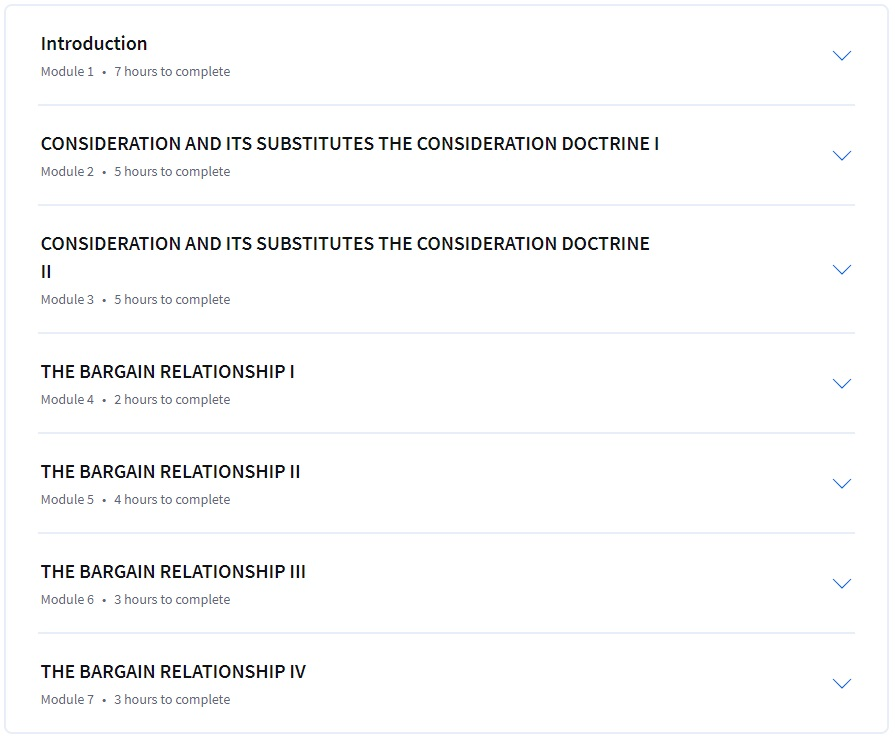

American Contract Law I, along with its companion course Contracts II, offers a thorough exploration of contract law in the United States. Designed to mirror the content of a first-year law school class, this course is structured into seven distinct modules, each focusing on key aspects of contract formation and enforcement.

The course's structure emphasizes self-directed learning, a departure from the traditional Socratic method employed in many law schools. This approach, while initially seeming insufficient due to its brevity (exemplified by an 18-minute lecture on Bailey v. West), proves highly effective. Students dedicate approximately 95% of their time to independent study, delving into case law, casebooks, and treatises. This format not only teaches the fundamentals of American contract law but also cultivates essential skills in legal analysis and research.

Each module is built around a series of common-law cases, seamlessly integrating legal doctrines with policy discussions. The course also covers critical sections of the Uniform Commercial Code (UCC), which governs the sale of goods. By the end of the course, learners gain a comprehensive understanding of contract formation, including concepts such as offer, acceptance, consideration, and promissory estoppel.

The seven modules cover:
1.	Offer and Acceptance
2.	Manifestation of Mutual Assent
3.	Obligations
4.	Consideration and Bargain Relationship

Each module contains multiple lesson blocks, focusing on specific prerequisites for contract formation. Within these blocks, case decisions are presented succinctly, allowing students to grasp the facts and rulings before diving into detailed lectures. The lecture videos, led by instructor Ian, provide in-depth analysis of precedent-setting cases, discussing the rationale behind judges' decisions and their implications for future contracts.

The course employs a multi-faceted assessment approach. In-video quizzes (IVQs) and practice quizzes serve as formative assessments, reinforcing learning without impacting the final grade. The graded component consists of seven Mastery Quizzes, one at the end of each module. To receive a certificate, students must complete all seven quizzes while maintaining an average score of 80% or above.

One of the course's strengths lies in its comparative approach, allowing students to contrast American Common Law of Contracts with other legal systems, such as the Iranian Civil Law of Obligations. This comparative perspective provides valuable insights into the nuances of different legal frameworks.

The course also familiarizes students with essential legal research tools like HeinOnline and LexisNexis, and introduces the concept of law reviews, which are less common in some legal education systems like Iran's. This exposure to various legal resources significantly enhances students' research skills and broadens their legal education.

While the exams were not particularly challenging, allowing for high achievement (in this case, a perfect score of 100), the course still demanded consistent effort and dedication. The relatively easier assessments did not diminish the overall educational value or the commitment required from students.

In conclusion, American Contract Law I offers a comprehensive, efficient, and practical approach to understanding U.S. contract law. Its structure caters not only to aspiring lawyers but also to business owners, landlords, artists, and anyone regularly engaged in buying or selling goods. By emphasizing self-study, comparative analysis, and practical skills, the course provides a solid foundation in contract law while developing crucial legal research and analysis abilities. This educational experience proves invaluable for future academic and professional endeavors in both American and international legal contexts.

You may check the course by Ian Ayres, William K. Townsend Professor of Yale Law, [here on Coursera](https://www.coursera.org/learn/contracts-1/). And for moe info, you check its homepage on [Yale Online](https://online.yale.edu/courses/american-contract-law-i).

**Who is Ian Ayres?**
> Ian Ayres is a lawyer and an economist. He is the William K. Townsend Professor at Yale Law School, the Anne Urowsky Professorial Fellow in Law, and a Professor at Yale's School of Management. Professor Ayres has been a columnist for Forbes magazine, a commentator on public radio’s Marketplace, and a contributor to the New York Times' Freakonomics Blog. He has published 11 books (including the New York Times best-seller, Super Crunchers) and over 100 articles on a wide range of topics. Ian is a co-founder of stickK.com, a web site that helps you stick to your goals. In 2006, he was elected to the American Academy of Arts and Sciences.

---

**Disclaimer:**

> This text is AI-written, but based on my own notes. I gave the chatbot my ideas and it reshaped them. Based on this fact, I believe this is considered good. Whatever, this is good thing.