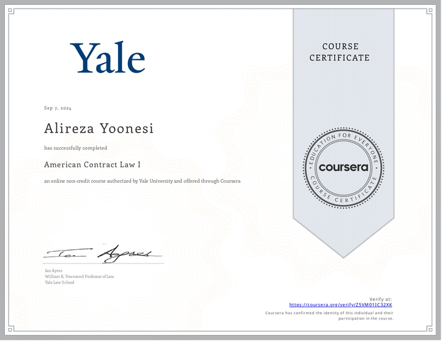
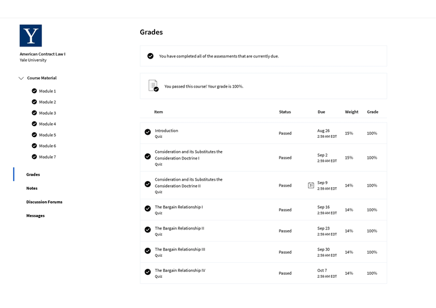

American Contract Law I and Contracts II give students a deep look into U.S. contract law. These courses match what first-year law students learn split into seven parts that cover how contracts start and get enforced.

The courses let students learn on their own, which is different from how many law schools teach. At first, this might seem too short - like an 18-minute talk on Bailey v. West - but it works well. Students spend about 95% of their time studying by themselves, reading cases, books, and legal writings. This teaches them about American contract law and helps them get better at looking at laws and doing research.

Each part uses real court cases to teach mixing legal rules with talks about policy. The courses also teach important parts of the Uniform Commercial Code (UCC), which deals with selling goods. By the end, students know a lot about how contracts are made, including ideas like offer, acceptance, consideration, and promissory estoppel.

The seven modules cover:
1.	Offer and Acceptance
2.	Manifestation of Mutual Assent
3.	Obligations
4.	Consideration and Bargain Relationship

Each module has several lesson blocks that cover specific requirements for forming contracts. These blocks present case decisions  helping students understand the facts and rulings before they watch detailed lectures. In the lecture videos, Ian, the instructor, gives a thorough breakdown of landmark cases. He talks about why judges made their decisions and how these rulings affect future contracts.

The course uses different ways to test students. In-video quizzes (IVQs) and practice quizzes help students learn without affecting their final grade. The graded part includes seven Mastery Quizzes, with one quiz at the end of each module. To get a certificate, students need to finish all seven quizzes and keep an average score of 80% or higher.

One of the best things about this course is how it helps student to compare different legal systems. Students can see how American Contract Law differs from other systems, like the one in Iran. This comparison helps students understand the small differences between various legal frameworks.

The course also urges, though indirectly, students to use important legal research tools like HeinOnline and LexisNexis. It teaches them about law reviews, which aren't as common in some legal education systems, like Iran's. Learning about these different legal resources helps students become better at legal research.

The exams weren't too hard, so students could score well (in this case, a perfect 100). But the course still needed students to work hard and stay focused. Even though the tests were easier, the virtual class still taught a lot and required students to put in effort.

To wrap up, American Contract Law I teaches U.S. contract law in a thorough, quick, and useful way. It's good for future lawyers, but also for business owners, landlords, artists, even programmers (as I argue that I am :D), and anyone who often buys or sells things. The course makes students study on their own compare different ideas, and learn practical skills. This helps them understand contract law well and get better at researching and analyzing legal stuff. What students learn here helps them a lot in future studies and jobs, both in American law and international law.

You may check the course by Ian Ayres, William K. Townsend Professor of Yale Law, [here on Coursera](https://www.coursera.org/learn/contracts-1/). And for moe info, you check its homepage on [Yale Online](https://online.yale.edu/courses/american-contract-law-i).

**My Certificate & Grades:**

**Who is Ian Ayres?**
> Ian Ayres is a lawyer and an economist. He is the William K. Townsend Professor at Yale Law School, the Anne Urowsky Professorial Fellow in Law, and a Professor at Yale's School of Management. Professor Ayres has been a columnist for Forbes magazine, a commentator on public radio’s Marketplace, and a contributor to the New York Times' Freakonomics Blog. He has published 11 books (including the New York Times best-seller, Super Crunchers) and over 100 articles on a wide range of topics. Ian is a co-founder of stickK.com, a web site that helps you stick to your goals. In 2006, he was elected to the American Academy of Arts and Sciences.