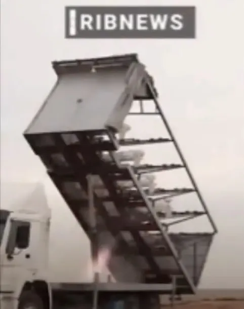
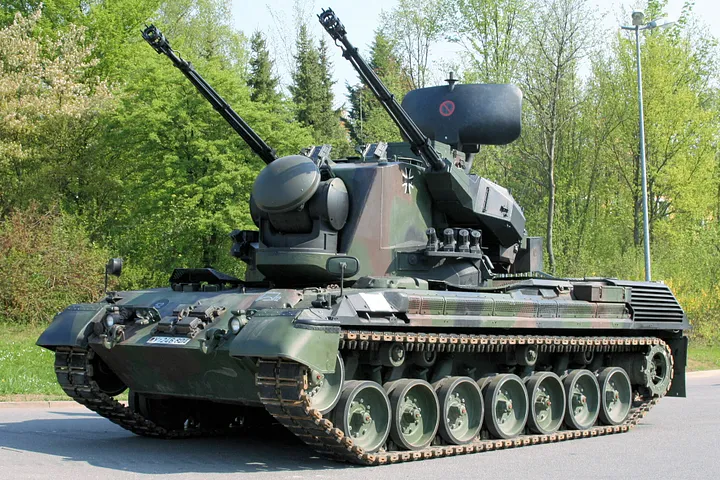

While the Kalibr 3M14, a Russian competitor to the American-made Tomahawk missile, costs the Russian military one million dollars (or roughly six million dollars for export), the Iranian Kamikaze drone has a price tag of fewer than twenty-five thousand dollars, which is half the average price of a car in the US and roughly one percent of the Tomahawk price tag. It appears to be a low-cost cruise missile that can be effective when fired in groups.

## How Is It Powered?
Well, the engine is a four-cylinder Mado MD550 engine, an inferior copy of the German Limbach L550e engine using Chinese parts and assemblies. A similar engine was spotted in Syria in 2014 before. I discovered a Chinese supplier selling each of these engines online for about $17,000. An extremely slow and noisy 50-horsepower civilian engine. Watch the video here to see how noisy it can be:



It makes me think of the German Stuka Siren during World War II. Stuka was originally built this way to disrupt the mindset of the ground forces, but on a modern battlefield, this kind of noise can undermine the effectiveness of the operation.

More info on the engine can be found [here](http://www.uavstar.com/Products/Engine/Engine_e.htm#:~:text=crankshafts%2C%20Exhaust%20stacks-,MD550,-Four%20cylinder%2C%20horizontally), and [here](https://www.militarydrones.org.cn/md-550-engine-price-p00583p1.html). You could aquire these engines from Aliexpress. I've seen lots of tweets on this specific engine:





This video shows some info on it, at least you'll know how it looks like:


## Navigation
Because it is not a US-friendly weapon, it is unlikely to use GPS and must instead rely on GLONASS if operated by Russians, which increases its capabilities but not significantly. It could also be using Anti-radiation Seeker for navigation, as Iran appears to use this type of technology due to its ease of use and low cost.

> Anti-radiation seekers are intended to detect and target an enemy radio emission source. Typically, these are intended for use against an enemy radar, though jammers are also available in theory.

## Possible Range
Using the data from the drone, I mean the Delta wing configuration and the engine, it must have an operational range of over 1000 kilometers. For instance, the distance between the Crimean Peninsula and Odesa (a Ukrainian city) is less than 300 kilometers. So it can be useful considering the low price.

## Is It Deadly?
When discussing just one of these drones, it’s difficult to say whether it’s lethal. According to Iranian state-sponsored media, a single Shahed-136 can carry a warhead weighing no more than 35 kilograms.

According to the footage, this drone is launched from the back of a cargo carrier, and each carrier contains about 5 of these drones. Because these drones are small, a swarm of 5 to 10 of them can carry no more than 300 kilograms of explosives. All of this suggests that a swarm of these drones could cause significant damage that cannot be ignored if all are not shut down.

## The Disadvantages
Because Iran is a sanctioned nation, it is well known that no amount of money, no matter how generous, will allow for the shipment of weapons to Iran. The military of Iran assembles its weapons using industrial machinery. This demonstrated that these drones are most likely designed in a way that can be obstructed or jammed.

It is unlikely that the Russian military will upgrade its original design to use more durable Russian military navigation systems at this point in the conflict because Russia is almost completely out of resources. Personally, I think the Russians will soon upgrade the system if they haven’t already.

Images revealed that the drone had no optical sensors, and it most likely only had one-way communications. This implies that you are limited to sending orders and that the HQ is not contacted. In essence, it performs the same function as a low-cost cruise missile, whereas modern cruise missiles can analyze terrain to be more precise.

The German Flakpanzer Gepard is the answer. Even though it has radar, a swarm of five to ten drones will only leave one or two intact to cause damage. Radars aren’t always successful in locating them in the sky because of their small size and slow speed. Since both sides employ Soviet radars that are set up to detect targets in the sky that are much bigger and moving much faster. The issue with Gepard is that, despite being very helpful, they are scarce.

Another option is to use rockets made specifically to take out attack helicopters. For instance, I believe the AGR-20 Advanced Precision Kill Weapon System (APKWS) could be beneficial. Shahed-136 flies at low altitudes and even worse, it has a speed of 180 kilometers per hour, making it easily destroyed by a javelin. But the real question is whether the Ukrainian military will be so foolish as to point its priceless Javelins at an inexpensive Iranian Kamikaze drone and fall victim to a Russian trap. No, in my opinion. Due to the civilian engine’s inadequate heat output, older surface-to-air missiles like the Strela-2 can be less effective.

I don’t believe that manned vehicles and Soviet-era machine guns can effectively take out these drones. Comical images of Ukrainian military personnel using AK-47s to hunt down drones aren’t more than a joke.

## Do Russians Need Kamikaze Drones?
Answering this question is challenging. I feel that the information and atmosphere surrounding Iranian drone use in Ukraine are so murky. It is questionable whether these drones are important, though. I simply say “no” in that manner.

High-quality aerial sensors, which the Russians lack and Iran hasn’t previously provided, are necessary to be able to view the fight, especially areas behind the frontline. Unless otherwise proven, it doesn’t appear that commercial equipment shipped from China can accomplish this.

Kamikaze drones may reduce spending and also result in more losses on the Ukrainian side, but make no ultimate change in the outcome of the war, and learning to disable them is no impossible task and Ukrainian troops can learn to fill in the blanks in weeks.