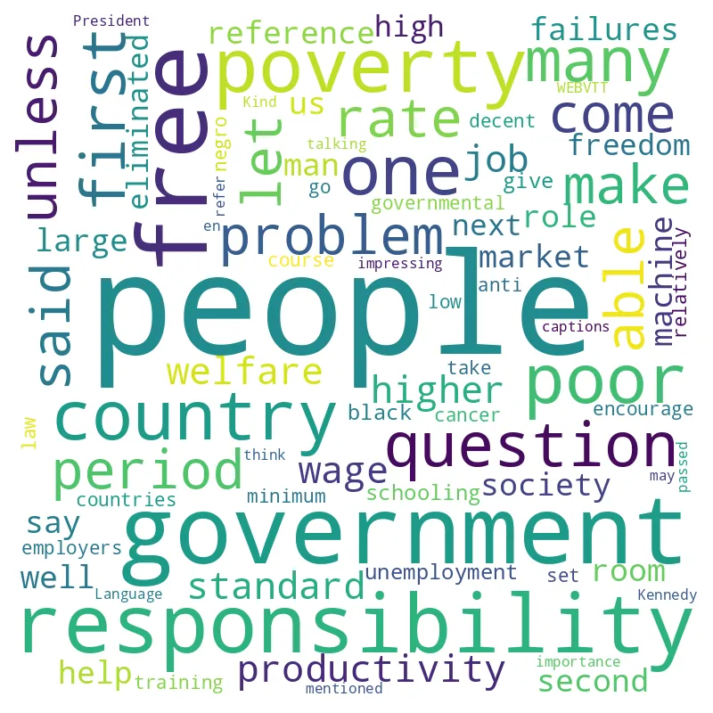
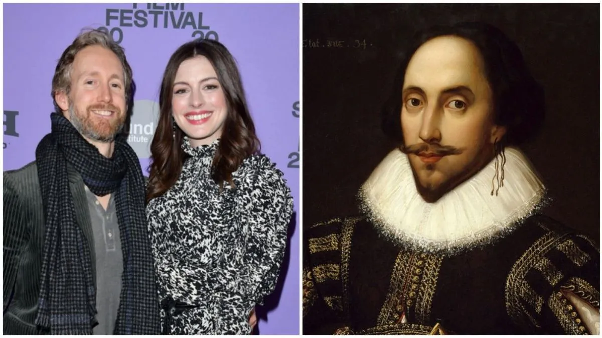
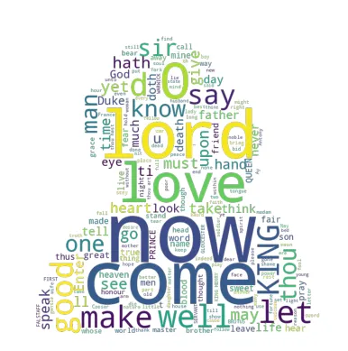
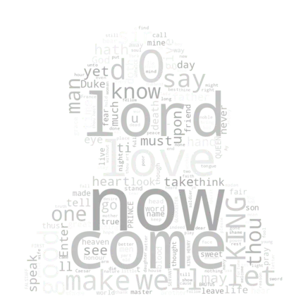
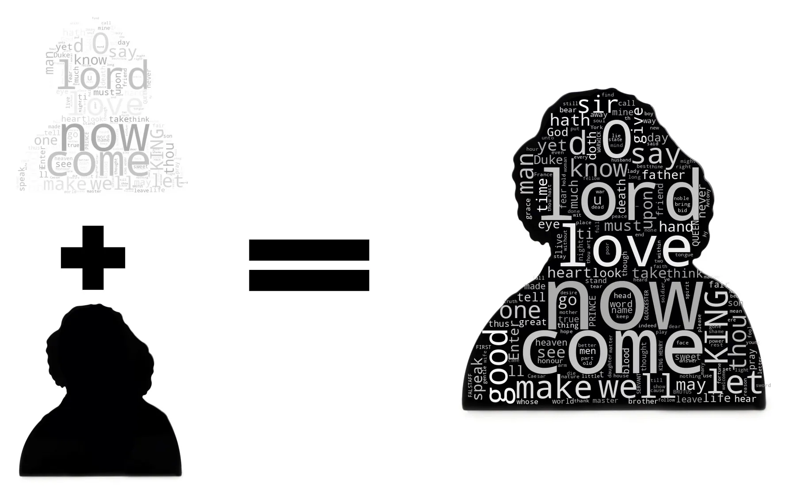

## Manifesto

These days, I got nothing to do but _Hydrate_ and do some codes on personal projects, read books and articles, and of course, _Hydrate again_, just like in the Jarhead (2005).


A few days ago, I was wondering about what Shakespeare was thinking (and writing), and at the same time, I was working on a [project](https://github.com/AYoonesi/yt-cloud) that revealed what YouTube creators were thinking based on Word-Clouds from their videos. It takes the URL of a video and returns the Word-Cloud. [Check the project on my GitHub(AYoonesi/yt-cloud).](https://github.com/AYoonesi/yt-cloud) Or simply check the [final product here](https://yt-cloud.herokuapp.com/).


## What is a Word Cloud?

Well, a word cloud, is a semi-good or not-bad resource for researchers that may be used to analyze qualitative data in the form of texts. It is beneficial in presentations and other situations. In fact, I use it to determine how leftist someone is by seeing a lot of terms like _inequality, rich and poor people_. It’s not the most precise method, but it’s quick.

It allows me to quickly grasp what the video is about; for example, if I see a video of Milton Friedman with a large _poverty_ in it, I know that this particular video is just some idiot student asking stupid questions.

A word cloud is something like the picture below:

> A few decades ago, a student inquired about the state’s role to combat poverty. This world is fucked. [Watch the video.](https://www.youtube.com/watch?v=Rls8H6MktrA)

## Why Shakespear?

In truth, I was considering what Iranian poet Hafez was thinking, but I soon concluded that most people outside of Iran just don’t give a damn. I thus made Shakespeare out of it. Shakespeare was preferable, however Dante was also a solid option. The cause? simply because Shakespeare introduced over 1700 new terms to the English language while using about 30,000. That is a lot.


Who wouldn’t want to bed Shakespeare if he were a genius?

## How to Get The Data?

There are probably no copyright concerns because he is deceased. The Gutenberg project was utilized. There are many eBooks available in a variety of formats. [Shakespear’s page on Gutenberg project.](https://www.gutenberg.org/ebooks/author/65) In there, I downloaded his whole writings in a single text file ([link to the file](https://www.gutenberg.org/ebooks/100.txt.utf-8)).

I’m going to use Python in this project so I suggest you have it installed as well as Jupyter Notebook. Let’s get it started. First of all, I import the packages needed:

```
import matplotlib.pyplot as plt
from wordcloud import WordCloud, STOPWORDS
from PIL import Image
import numpy as np
import random
```

Then I open my txt file which includes our famous guy’s writings (around 5 megabytes of data) and do some cleaning:

```
# File name is pg100.txt
with open('pg100.txt') as seed:
lines = seed.readlines()
seed = " ".join(lines).replace('\n', ' ').replace("\'", "'")
```

In order to have a clean word cloud, you need to have good Stop-Words. We use stop words to omit words like _am, is, are, a,_ etc. and I added a special function to disable colors in the output:

```
# Add your stop words here:
my_sw = set(['will', 'thee', 'thy', 'will', 's',])
my_sw.update(STOPWORDS)

def grey_color_func(word, font_size, position, orientation, random_state=None,**kwargs):
    return "hsl(0, 0%%, %d%%)" % random.randint(60, 100)
```

Then I use the WordCloud object to create what we want, this way:

```
word_cloud = WordCloud(
    background_color=None,
    mode='RGBA',
    normalize_plurals=True,
    stopwords=my_sw,
    mask=np.array(Image.open('mask.png'))
).generate(seed).to_file('colored.png')
plt.imshow(word_cloud)
plt.axis('off')
plt.show()
```

It will red my mask file (mask.png) and creates a colorful word cloud like this:


If I use my grey\_color\_func and save the file again with this code:

```
word_cloud.recolor(color_func=grey_color_func).to_file('not-colord.png')
plt.imshow(word_cloud)
plt.axis('off')
plt.show()
```

Now I have a picture like this:



Which can be tweaked like this:



The full source code and files can be found on my [Github](https://github.com/AYoonesi/medium/) under the folder [Shakespeare](https://github.com/AYoonesi/medium/tree/main/Shakespear).
