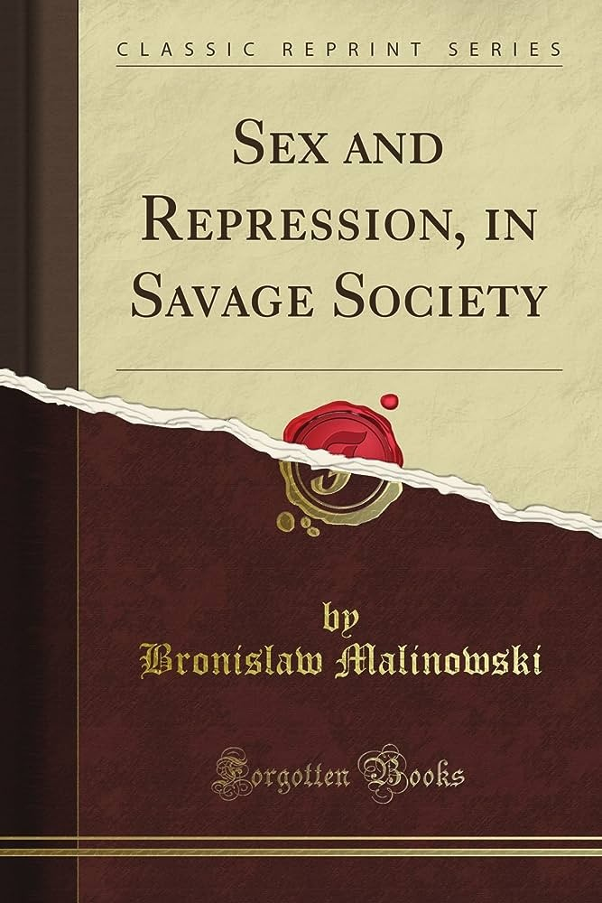

In his seminal work, “Sex and Repression in Savage Society,” Bronisław Malinowski delves deep into the intricate nuances of human sexuality within indigenous cultures, unearthing a treasure trove of enlightening observations and thought-provoking analyses. Employing his astute anthropological lens, Malinowski transports readers into captivating narratives of tribal societies, skillfully interweaving empirical evidence with lyrical descriptions of exotic rituals and customs.

Malinowski’s scholarly prowess is artfully showcased in his meticulous examination of the multifaceted dynamics governing sexual practices in these savage societies. His acute attention to cultural intricacies allows him to deftly dissect the delicate balance between internal desires and socially imposed constraints, bringing to the fore the intricate nature of repression and its profound impact on human sexuality. With erudition and grace, Malinowski illuminates the complex interplay between innate urges and the regulatory mechanisms that emerge within each unique cultural tapestry.

Throughout his discourse, Malinowski maintains a resolute commitment to accuracy and impartiality, ensuring his research delves beyond the surface and penetrates the essence of the sexual realms under scrutiny. His empathetic approach allows for a nuanced understanding of diverse belief systems, challenging preconceived notions and shedding light on the rich spectrum of human sexual expression. The vivid anecdotes he employs provide a compelling backdrop, transporting readers to the heart of these societies and fostering a deep sense of intrigue and empathy.

Malinowski’s capacity to deftly navigate the intricate labyrinth of social taboos sets “Sex and Repression in Savage Society” apart as a masterpiece of anthropological inquiry. He paints a vivid tapestry of the myriad ways in which primal impulses are confined by societal mores, thus underscoring the fundamental human struggle for self-expression amidst a backdrop of cultural norms and expectations. His astute observations shed light on the essential paradox of sexual repression - the weights it imposes, yet also the stability it confers upon society.

Employing a lucid and eloquent prose, Malinowski guides readers through a multitude of conceptual frameworks while injecting his work with a sense of aesthetic finesse. By blending rigor and literary dexterity, he constructs an intellectual pilgrimage for the reader, fomenting introspection and reflection on the broader contours of human sexuality in all its complexity.

Beyond its scholarly prowess, “Sex and Repression in Savage Society” stands as a crucial testament to the irreducible power of comparative analysis within the field of anthropology. Malinowski expertly juxtaposes the dichotomy between savagery and civilization, challenging overarching assumptions about the universality of human sexuality and offering a more nuanced understanding of its kaleidoscopic manifestations across cultures.

In conclusion, Malinowski’s “Sex and Repression in Savage Society” is an exquisite work of ethnographic exploration, transcending conventional boundaries to eloquently unravel the mysteries and tensions of human sexuality within tribal communities. With its accuracy, empathy, and literary finesse, this seminal piece of scholarship remains a lasting testament to the depth and breadth of human experience, igniting intellectual fervor and inspiring future generations of anthropologists and readers alike.

